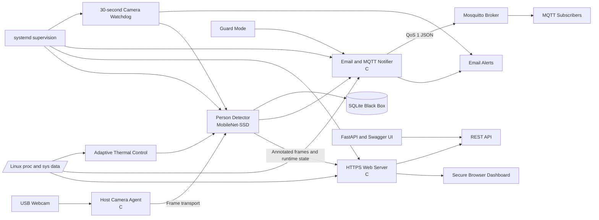

# Smart Guard Embedded System

This repository contains the implementation of a real-time **Smart Guard** platform developed for the Real-Time Embedded Systems final project at Sharif University of Technology. The system combines live video streaming, person detection, system monitoring, secure web access, REST APIs, email alerts, MQTT messaging, event history, camera-failure recovery, and adaptive thermal management in one integrated embedded application.

The project was developed incrementally in four sections. Each section adds a new set of capabilities while preserving the work completed in the earlier stages. The final implementation is available in `section4/`, while `section1/`, `section2/`, and `section3/` document the development process and the tests performed at each milestone.

Most of the application logic is written in **C**, as required by the project specification. Python is used only for the person-detection process and the thin FastAPI/Swagger documentation layer. The repository also includes configuration templates, systemd units, installation scripts, test tools, raw measurements, plots, screenshots, and demonstration videos.

---

## Project Overview

The main purpose of the project is to build a complete monitoring system rather than a standalone computer-vision program. A camera continuously captures the environment and sends frames to the processing side of the system. The vision module detects people and produces an annotated stream containing bounding boxes, the current person count, the student ID, the live date and time, and the measured frame rate.

At the same time, the system collects CPU temperature, CPU utilization, and free-memory information directly from Linux system interfaces. These values are displayed on a secure dashboard and are also available through REST endpoints. When a person is detected, the system can send an email containing the event information and a captured image, publish a structured MQTT message, and store the event in a local SQLite database.

The final version also includes a guard mode for urgent alarms, a software watchdog for detecting camera interruption, and adaptive thermal control for reducing the vision workload when the processor becomes too hot. All major services are managed by systemd so that the platform starts automatically after boot and recovers from crashes without manual intervention.

---

## System Architecture

The project was implemented with a **host and Linux VM** architecture. This arrangement was used because the physical webcam was connected to the host computer, while the main embedded application was executed inside the Linux VM. The same design can be adapted to an Orange Pi by moving the VM-side services to the board.

The host machine captures frames from the USB webcam through a C host agent. It also runs the Mosquitto broker used by the messaging subsystem. The VM receives the camera data and runs the vision process, C web server, telemetry backend, email and MQTT notifier, Swagger layer, SQLite black box, watchdog, and thermal-management logic.

External users interact with the system through three main interfaces. A browser displays the secure dashboard and live video stream, an email account receives event notifications, and MQTT subscribers receive person, telemetry, status, and alarm messages.



### Runtime Data Flow

During normal operation, the host agent reads frames from the webcam and forwards them to the VM. The vision module loads the MobileNet-SSD model, detects the `person` class, draws the required information on each frame, and updates the shared runtime state. The C web server then serves the annotated MJPEG stream and the live dashboard.

Detection information is also passed to the notifier. The notifier uses the latest person count, timestamp, CPU temperature, and snapshot to prepare email alerts and MQTT payloads. In the final section, the same event is recorded in SQLite and is evaluated by the guard-mode logic. The watchdog independently checks whether fresh frames are still being produced, while the thermal controller adjusts the processing settings according to CPU temperature.

---

## Main Technologies

| Area | Technology |
|---|---|
| Core application | C |
| Build system | CMake |
| Person detection | Python, OpenCV DNN, MobileNet-SSD |
| Web server | Custom C HTTP/HTTPS server |
| API documentation | FastAPI and Swagger UI |
| Transport security | OpenSSL and a self-signed certificate |
| Messaging | Mosquitto and libmosquitto |
| Message format | JSON |
| Email alerts | SMTP through the C notifier |
| Event storage | SQLite circular history buffer |
| Service supervision | systemd |
| Telemetry sources | Linux `/proc` and `/sys` interfaces |
| Testing | Bash, Python, curl, journalctl, stress tools, CSV logs, plots, screenshots, and videos |

---

## Repository Structure

```text
embedded_project/
├── Final_Proj_Embedded.pdf   # Official project specification
├── report.pdf                # Final technical report
├── section1/                 # Secure dashboard and automatic services
├── section2/                 # REST API, Swagger, monitoring, and recovery tests
├── section3/                 # Detection, email, MQTT, and security tests
└── section4/                 # Final integrated smart-guard system
```

Each section is self-contained and includes the source code, configuration examples, service files, scripts, tests, and evidence required for that stage. The `config/` directories contain environment-file templates, while `systemd/` contains the service definitions used for startup ordering and automatic recovery. Host-side camera code is stored under `host/`, and the VM-side application is divided between directories such as `web/`, `src/`, `vision/`, `swagger/`, and `watchdog/`.

The `scripts/` directories contain installation, staging, model-download, configuration, and upgrade tools. Repeatable tests are stored in `tests/`, and the results are collected under `docs/evidence/`. These evidence directories include screenshots, raw terminal output, CSV measurements, JSON responses, plots, analysis files, and videos. The final sections also include `MANIFEST.txt` and `SHA256SUMS.txt` files for delivery verification.

---

## Section 1: Web Server, Automatic Startup, and SSL

Section 1 establishes the basic runtime platform. A C host agent captures the camera stream, while the VM runs the first version of the web server, the vision process, and the MQTT component. The browser page displays the live stream together with the student identity, current person count, CPU temperature, free memory, and CPU utilization. Telemetry values are refreshed automatically so that the dashboard reflects the current system state.

Secure access was added with a self-signed OpenSSL certificate whose Common Name contains the student ID. The application is available through HTTPS, and requests received over plain HTTP are permanently redirected to HTTPS with status code 301. A fallback `no-camera.jpg` image is also available when a camera frame cannot be displayed.

The services are controlled by systemd. The service files define the correct startup order with `After=` and `Requires=` and include restart policies so that a failed process is relaunched automatically. This allows the complete application to start after boot without requiring any terminal commands.

The main units introduced in this section are:

```text
smart-guard-host-agent.service
smart-guard-vision.service
smart-guard-web.service
smart-guard-mqtt.service
```

The required experiments for this section were completed and documented. Boot time was measured with `systemd-analyze`, automatic recovery was verified by terminating the web server with `kill -9`, and a full power-cycle demonstration confirmed that the platform starts without manual interaction. HTTP redirection and certificate details were inspected through the browser and command-line tools, and the final dashboard was recorded with the required identity and live information visible.

---

## Section 2: RESTful API and Live Monitoring

Section 2 extends the original dashboard with a structured REST API. The application logic remains in C, while FastAPI is used only as a thin Swagger/OpenAPI layer that documents the endpoints and forwards requests to the C backend. This design keeps telemetry collection, person counting, streaming, history handling, and command execution inside the main C application.

CPU temperature and memory information are read directly from the relevant Linux files instead of being obtained by executing shell commands. The command endpoint is implemented in an extensible form so that new commands can be added later without redesigning the entire API.

| Method | Endpoint | Description |
|---|---|---|
| `GET` | `/api/v1/stream` | Returns the live MJPEG camera stream |
| `GET` | `/api/v1/persons` | Returns the current person count and timestamp |
| `GET` | `/api/v1/telemetry` | Returns CPU temperature, free memory, and CPU utilization |
| `POST` | `/api/v1/command` | Accepts supported runtime commands through a generic interface |
| `GET` | `/api/v1/history` | Returns the latest detection records |

All endpoints can be executed from the Swagger UI against the running C service. The repository contains screenshots showing real responses for the stream, person count, telemetry, command, and history operations.

This section also introduces systematic performance and reliability testing. CPU temperature was recorded for five minutes in idle, stream-only, and stream-plus-detection modes. Memory usage of the C process was sampled during continuous streaming to check for leaks. A concurrent load test sent 50 requests to the telemetry endpoint and compared response latency, CPU load, temperature, and memory use with the baseline state. Network recovery was tested by disconnecting the host and VM connection and observing whether the application recovered after connectivity returned.

The resulting CSV files, plots, histograms, logs, screenshots, and analysis notes are stored in `section2/docs/evidence/`.

---

## Section 3: Person Detection, Email, and MQTT

Section 3 adds the main smart-surveillance behavior. The vision process uses a lightweight MobileNet-SSD model through OpenCV DNN. The model configuration and weights are stored in `vision/models/` as `deploy.prototxt` and `mobilenet_iter_73000.caffemodel`. A download script is included so that the model files can be prepared on a new installation.

For every frame, the detector searches for the `person` class and draws a bounding box around each detected person. The final stream also contains the current count, student ID, live date and time, and measured FPS. This annotated stream is used both by the dashboard and by the alert system.

### Email Notifications

The email notifier is implemented in C in `src/smart_guard_notifier.c`. When one or more people are detected, it prepares a message containing the person count, event timestamp, current CPU temperature, and an image captured at the moment of detection.

To prevent a continuous detection from generating a large number of messages, the normal alert path uses a 30-second debounce interval. After a successful email, the notifier records the send time and suppresses additional standard alerts until the interval has passed. The detection itself continues normally; only repeated email transmission is limited.

### MQTT Communication

The Mosquitto broker runs on the host computer, and the embedded-side client is written in C. Person and telemetry information is published as JSON through the required topic structure:

```text
persons/<student_id>/home
telemetry/<student_id>/home
```

Messages use QoS 1 so that delivery is acknowledged with PUBACK. Last Will and Testament is configured to report an unexpected client disconnection, and reconnect logic restores communication when the broker becomes available again. Anonymous access is disabled, clients use dedicated credentials, and ACL rules restrict access to the permitted topics.

The experiments in this section evaluate both accuracy and communication reliability. Detection was tested under daylight, artificial light, low light, and backlight. A spoofing test used an image of a person displayed on a phone or paper to study the limitations of a standard object detector. Three input resolutions were compared using accuracy, FPS, CPU temperature, and memory consumption. The broker was stopped and restarted to verify LWT and reconnection behavior, and end-to-end MQTT latency was measured over ten samples after synchronizing the host and VM clocks. Separate tests confirmed that unauthorized MQTT and SSH connections are rejected while valid access remains available.

---

## Section 4: Advanced Smart-Guard Features

Section 4 is the final integrated version of the project. It combines the dashboard, REST API, person detection, email notifier, MQTT client, security rules, and systemd services from the previous sections and adds four advanced capabilities: guard mode, a SQLite black box, a software watchdog, and adaptive thermal management.

### Guard Mode

Guard mode can be armed or disarmed from the HTML dashboard or through the API. The current state is displayed on the page so that the user can see whether the system is operating in normal monitoring mode or active protection mode.

When the system is armed, a valid person detection becomes an urgent alarm. The event immediately sends an email with a snapshot, publishes an emergency MQTT message, and records the event in the black box. Emergency MQTT messages use the following topic:

```text
alarm/<student_id>/home
```

The alarm path is kept separate from the normal debounced email path. As a result, an armed-system detection is delivered immediately rather than being delayed or suppressed by the standard 30-second interval.

### SQLite Black Box

Detection events and important system events are stored in SQLite. The database behaves as a circular buffer, which keeps the storage size bounded while preserving the most recent records. Stored data includes information such as event time, person count, event type, current system state, and the related snapshot reference.

The API provides access to recent black-box records and overall detection counters. Automated tests verify that records are inserted correctly, counters are updated, snapshots can be retrieved, and the SQLite database remains structurally valid.

### Software Watchdog

The watchdog is implemented in C in `watchdog/smart_guard_watchdog.c`. It checks the freshness of frames produced by the vision process. If no new frame is received for more than 30 seconds, the system treats the condition as a possible camera disconnection or tampering event.

After detecting this condition, the watchdog records a system event, sends a camera-tampering email, restarts the vision service, and waits for the stream to recover. The watchdog runs as an independent systemd service, so it can continue supervising the vision process even when that process fails.

### Adaptive Thermal Management

The final system continuously monitors CPU temperature. When the configured upper threshold is crossed, the vision workload is reduced by lowering the processing frame rate, the input resolution, or both. The transition is recorded and reported by email.

A recovery threshold lower than the activation threshold provides hysteresis. This prevents rapid switching between normal and throttled modes when the temperature is close to the limit. Once the processor cools sufficiently, the original vision settings are restored automatically.

Section 4 also adds Swagger documentation for the new endpoints, protected configuration permissions, stronger systemd dependency definitions, and verification scripts that inspect running services, listening ports, API status, model loading, database integrity, watchdog timing, MQTT behavior, and thermal configuration.

The final tests demonstrate the complete behavior of each advanced feature. Guard mode is armed and disarmed while alarm email and MQTT delivery are observed. Black-box records and counters are inspected through both SQLite and the API. The camera is disconnected long enough to trigger the watchdog, after which service restart and stream recovery are verified. Finally, CPU stress is used to activate thermal throttling and confirm that the normal operating mode returns after cooling.

---

## Security Design

Security is applied throughout the project rather than being added only to the final version. The dashboard and API are served over HTTPS, and plain HTTP traffic is redirected permanently. The self-signed certificate uses the student ID as its Common Name, as required by the project specification.

MQTT anonymous access is disabled. Every client must authenticate with a dedicated username and password, and ACL rules limit the topics that each client can access. The test suite includes attempts with no credentials and with an incorrect password to confirm that the broker rejects unauthorized connections.

SSH access is also hardened. Root login is disabled, unauthorized login attempts are rejected, and the tests confirm that the permitted user can still connect after the security configuration is applied.

Passwords, tokens, email credentials, private keys, and API secrets are not stored directly in the source code. The repository contains only `*.env.example` templates. Real values are created locally, given restricted permissions, and excluded from version control.

---

## Configuration

Configuration templates are located in the `config/` directory of each section. The final integrated version contains templates for email alerts, host-agent settings, MQTT credentials, Section 2 API values, Section 3 detection settings, Section 4 advanced features, and VM network configuration.

```text
alerts.env.example
host-agent.section3.env.example
mqtt.env.example
section2.env.example
section3.env.example
section4.env.example
vm.env.example
```

A deployment begins by copying the required example files to local runtime files without the `.example` suffix. The operator then sets the student ID, host and VM addresses, camera options, MQTT credentials, SMTP information, certificate paths, database limits, watchdog timeout, and thermal thresholds. Secret files should be readable only by the required service account.

After configuration, the host and VM installation scripts build the applications, install dependencies and service files, and prepare the runtime directories. The relevant verification script should be executed before collecting final evidence. Populated environment files, private keys, SMTP credentials, and MQTT password files should never be committed to the repository.

---

## Deployment Model

### Host Side

The host side owns the physical webcam and therefore runs the camera host agent. It forwards frames to the VM, hosts the Mosquitto broker, applies broker authentication and ACL rules, and provides subscriber tools used during MQTT and latency tests.

The most relevant final-section paths are:

```text
section4/host/
section4/broker/
section4/scripts/install_host_section4.sh
section4/scripts/configure_host_agent.sh
section4/scripts/install_broker_host.sh
```

### VM or Embedded Side

The VM, or an Orange Pi in a hardware deployment, runs the main smart-guard application. This includes vision inference, the C HTTPS web server, telemetry collection, REST endpoints, Swagger, email and MQTT notification, SQLite history, watchdog supervision, thermal management, and all systemd-managed services.

The main final-section paths are:

```text
section4/vision/
section4/web/
section4/src/
section4/swagger/
section4/watchdog/
section4/systemd/
section4/scripts/install_vm_section4.sh
```

Machine-specific commands and variables are documented in the README file inside each section.

---

## Services and Runtime Management

The final version uses five VM-side systemd units:

```text
smart-guard-vision.service
smart-guard-web.service
smart-guard-mqtt.service
smart-guard-swagger.service
smart-guard-watchdog.service
```

They can be enabled and started with the following commands:

```bash
sudo systemctl daemon-reload
sudo systemctl enable --now smart-guard-vision.service
sudo systemctl enable --now smart-guard-web.service
sudo systemctl enable --now smart-guard-mqtt.service
sudo systemctl enable --now smart-guard-swagger.service
sudo systemctl enable --now smart-guard-watchdog.service
```

The combined service state can be inspected with:

```bash
systemctl --no-pager --full status \
  smart-guard-vision.service \
  smart-guard-web.service \
  smart-guard-mqtt.service \
  smart-guard-swagger.service \
  smart-guard-watchdog.service
```

Runtime logs can be followed with:

```bash
journalctl -f \
  -u smart-guard-vision.service \
  -u smart-guard-web.service \
  -u smart-guard-mqtt.service \
  -u smart-guard-watchdog.service
```

The service definitions ensure that components start in a valid order and that failed processes restart automatically. This behavior is essential for unattended operation after reboot, power loss, application crashes, and temporary communication failures.

---

## Testing and Evidence

The project was designed to produce reproducible evidence for every required experiment. Each test has a corresponding script or documented procedure, and the results are grouped according to the section and requirement number.

Screenshots show browser pages, Swagger responses, terminal output, certificate details, MQTT activity, SQLite records, and service logs. Videos demonstrate automatic startup, guard-mode operation, camera disconnection, watchdog recovery, and other behaviors that cannot be represented completely in a still image.

CSV files preserve temperature, memory, latency, resolution, and recovery measurements. JSON files store API responses and test summaries, while journal logs provide evidence of service restart, broker reconnection, watchdog activation, and other runtime events. Python analysis scripts generate plots and statistical summaries, and Bash test runners make the experiments repeatable.

Important verification entry points include:

```text
section2/tests/verify_endpoints.sh
section3/tests/verify_section3.sh
section4/tests/verify_section4.sh
```

Because the raw data, analysis, and visual evidence are stored together, every major claim in the final report can be traced back to a recorded test result.

---

## Project Documents

The official requirements are available in [`Final_Proj_Embedded.pdf`](Final_Proj_Embedded.pdf), and the complete technical report is available in [`report.pdf`](report.pdf). More detailed setup and verification instructions are provided in the README file of each project section:

- [`section1/README.md`](section1/README.md)
- [`section2/README.md`](section2/README.md)
- [`section3/README.md`](section3/README.md)
- [`section4/README.md`](section4/README.md)

---

## Final Summary

This repository implements a complete smart-guard platform with secure live video, real-time person detection, embedded telemetry, REST APIs, email and MQTT alerts, automatic startup and crash recovery, authenticated remote access, persistent event history, camera-tamper detection, and adaptive thermal control.

The four-section structure preserves both the final application and the incremental engineering process used to build it. Every major feature is supported by source code, configuration templates, system services, test scripts, raw measurements, analysis files, and recorded evidence. The `section4/` directory represents the complete integrated system, while the earlier sections document how the platform evolved and how each requirement was validated.
